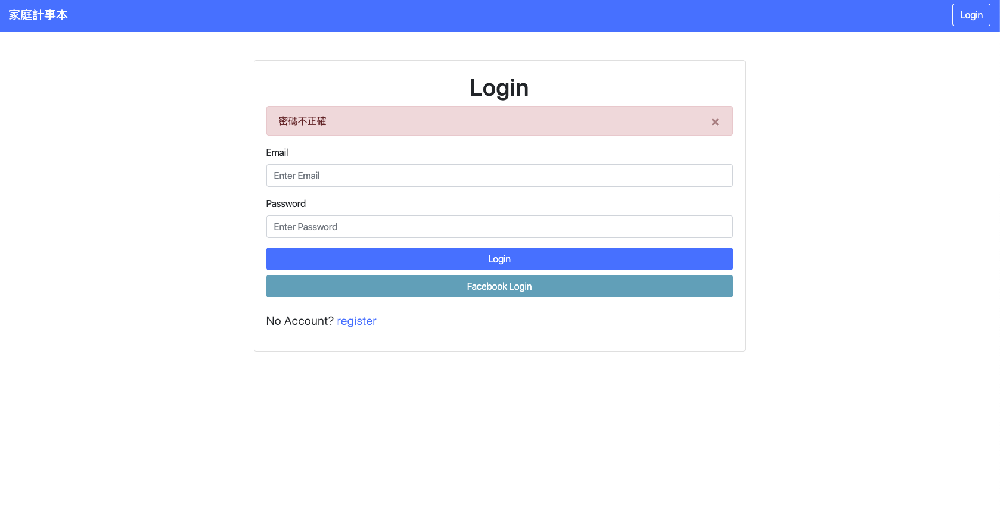
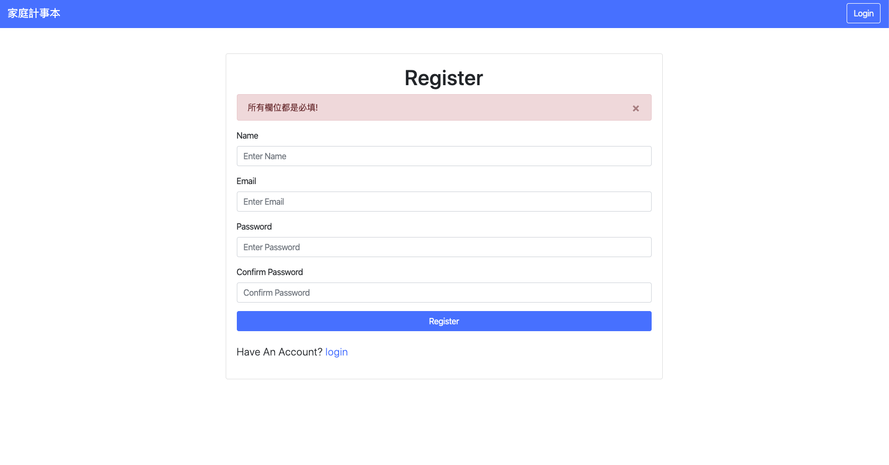
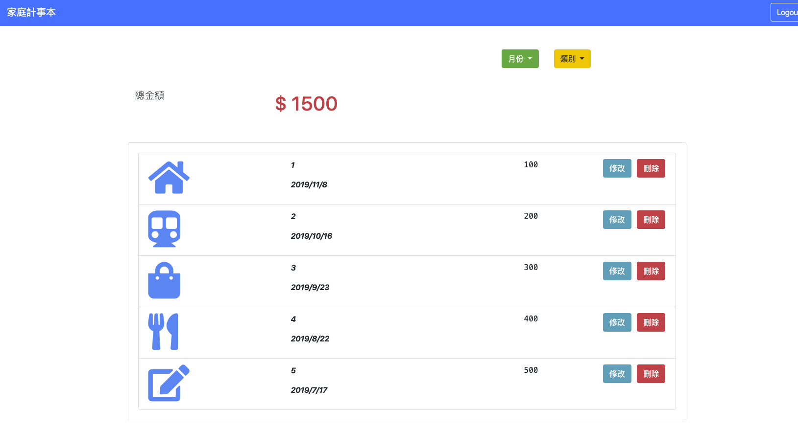

# 家庭記帳本 Expense tracker by Sequelize

使用 Node.js + Express + MySQL 打造的家庭記帳本網站，可以新增、刪除、修改，打造使用者認證系統，可以用 fb 登入，提供兩個篩選器:支出分類以及月份

## Features - 產品功能

- 使用者看到所有的支出清單
- 在首頁看到所有支出清單的總金額
- 使用者可以用在首頁可以根據支出類別與日期篩選支出；總金額的計算只會包括篩選出來支出
- 使用者可以新增一筆支出
- 使用者可以修改一筆支出
- 使用者可以刪除一筆支出
- 使用者可以註冊帳號，註冊的資料包括：名字、email、密碼、確認密碼
- 使用者註冊、登入時，有錯誤，會顯示告知使用者其中的錯誤訊息
- 使用者的密碼要使用 bcrypt 加密處理
- 使用者也可以透過 Facebook Login 直接登入

## Environment SetUp - 環境建置

- node.js v10.16.0
- express 4.17.1
- express-handlebars 3.1.0
- bcryptjs 2.4.3
- body-parser 1.19.0
- connect-flash 0.1.1
- dotenv 8.0.0
- express-session 1.16.2
- method-override 3.0.0
- passport 0.4.0
- passport-facebook 3.0.0
- passport-local 1.0.0
- nodemon 1.19.1
- connect-flash 0.1.1
- mysql2 1.7.0
- sequelize 5.19.6
- sequelize-cli 5.5.1

## Installing - 專案安裝流程

1. 安裝 MySQL
```
打開安裝檔，同意並點擊完安裝後，選擇 "Use Legacy Password Encryption"，按繼續並設置一組密碼，安裝完畢後啟動 MySQL
```

2. 安裝 MySQL Workbench
```
開啟 MySQL Workbench, 點擊Local instance 3306, 密碼即是安裝時設定的密碼 在工作區寫以下程式碼, project name 和檔案中的package.json裡的name一樣
drop database if exists project name;
create database project name;
use project name;
select * from users;
select * from records;
```

3. 打開你的 terminal，Clone 此專案至本機電腦

```
 https://github.com/lesterhua/SEM3-S9-A30-Final-Exam-expense-tracker-sequelize.git
```

4. 開啟終端機(Terminal)，進入存放此專案的資料夾

```
cd expense-tracker-sequelize
```

5. 安裝 npm 套件

```
在 Terminal 輸入 npm install 指令
```

6. 加入資料到MySql

```
在 Terminal 裡輸入 npx sequelize db:migrate
```

7. 在根目錄下新增.env 檔案串接您的 facebook 登入資訊

```
FACEBOOK_ID=XXXXXXXX
FACEBOOK_SECRET=XXXXXXXX
FACEBOOK_CALLBACK=http://example.com/auth/facebook/callback
```

8. 執行專案

```
在 Terminal 輸入 npm run dev  指令
```

#### 安裝成功後，會在終端機看到訊息"Express is running on :http://localhost:3000

## 畫面 - Demo







## 作者 - Authors

[Lester](https://github.com/lesterhua)
